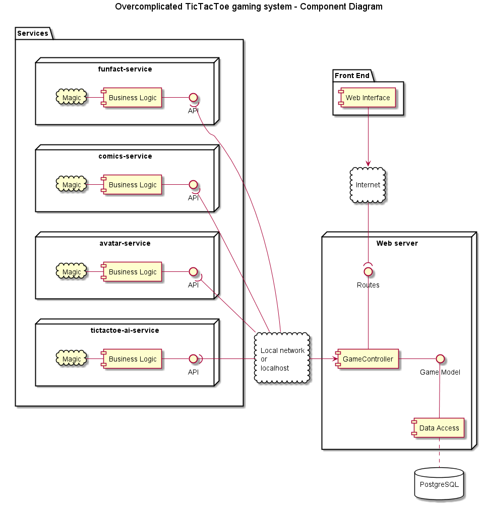

# Overcomplicated TicTacToe

Your job is to write a single player TicTacToe game based on microservices. 
First you have to model the game (state and movements), and connect it with the UI. 
Then write a simple version for all the extra services and wire them together. 
Then you should upgrade the services either by adding new features or by re-using existing third party services.
For example, there is a nice TicTacToe AI solution out there you can use for the machine's move. After that you can come up with your own AI solution. 

## Run

The Repository contains five separate modules, four of them are completely empty.
You can start `overcomplicated-ticatactoe`, a Spring Boot application. 
It has a single page with the basic functionalities all set.

## What to do next?

### The vision

The idea behind this system is to build multiple services for smaller parts. 
This will allow autonomous development and maintenance. 
The *architect guy* created the following component UML:

## Services one by one</a>

The project, beside the main application, should contain several services. 
You can use any framework, Spring, Spark, or even Flask with Python if you like.
They should use ports from 60000.

### funfact-service

This service generates a fun fact for showing it next the game board to make your TicTacToe more fun.
You can use your own collection first, then implement it using for example this Chuck Norris fact generator: https://api.chucknorris.io/.

### comics-service

A service to help showing a comic. One possible source is to return a random piece from 
http://xkcd.com/. 
Use xkcd's JSON API, http://xkcd.com/1001/info.0.json, where 1001 is a random number between 1 and 1929.
This API returns a lot of info, use only the image and the hover text.

### avatar-service

It should generate a profile avatar picture's URI.
It can be anything, the only requirement is to keep the picture unchanged during the session.
Possible sources:
- https://robohash.org/
- http://avatars.adorable.io/

Read the documentations, and use the solution that you like.

### tictactoe-ai-service

The logic behind the computer's move. 
First use a 'dumb' solution. 
Then you can boost up the computer's success by using this service, written in Node.js and running on Heroku:

- Repository: https://github.com/stujo/tictactoe-api
- Hosted version example call: http://tttapi.herokuapp.com/api/v1/-O-----X-/O
 
If you use `stujo`'s API signature for your own service, the the forwarding and the switch will be pretty easy.

 
## Extra features

- Use proper logging for your services
- Write mocks and tests for your services
- AJAXify the movement clicks
- Use template fragments to reduce duplication
- Make a UI switch to change between different AIs (yours and `stujo`'s)
- Add a multiplayer mode as well
